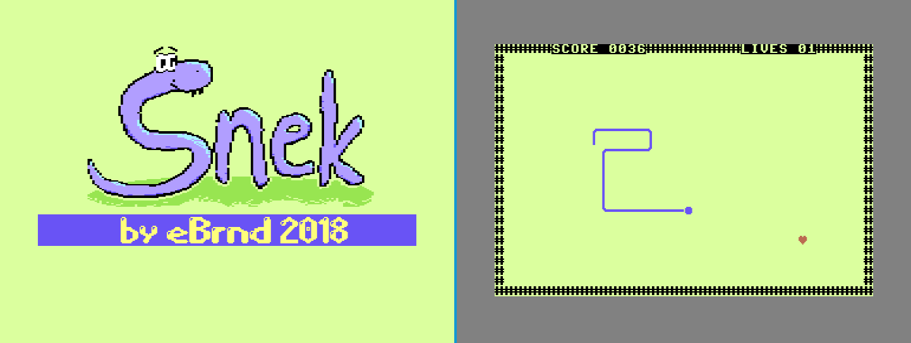

snek
====

I made a Commodore 64 game! It's another remake of a classic!

How to Run
----------

It needs a joystick plugged into port 2. Use your favorite means of transferring data to a C64, for
instance an IEC2SD. Just go `LOAD"*",8`, and then `RUN`. At the title screen, press the fire button
to start the actual game.

It also works in an emulator. Using VICE on Linux, you can start it using
`x64 -joydev2 1 snek.prg`. The `joydev2 1` configured the numpad to control emulated joystick
plugged into the emulated port 2 of you emulated C64.

Links
-----

* dasm Assembler: http://dasm-dillon.sourceforge.net/
* cheesecutter: http://theyamo.kapsi.fi/ccutter/
  * I made the title screen music with this
  * Great tutorials on youtube: https://www.youtube.com/playlist?list=PLqMMxoX68R7JDbIZ2WJnOycQEBJpV1f3G
* Tiamanthes: http://csdb.dk/release/?id=75871
  * I made the title screen picture with this
* Commodore 64 Programming on Windows (Tutorial): https://github.com/petriw/Commodore64Programming
  * A great way for me to get started, although I didn't even use Windows for coding
* And a bunch of other resources, like:
  * c64-wiki.com
  * http://www.masswerk.at/6502/6502\_instruction\_set.html#ADC
  * https://www.waitingforfriday.com/?p=661 (SID Datasheet)
  * http://sta.c64.org/cbm64mem.html

